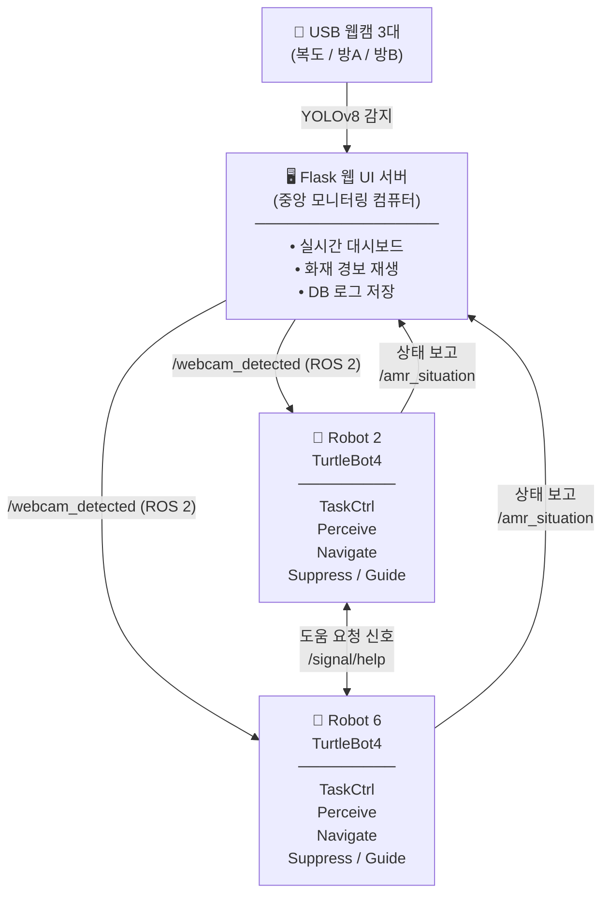
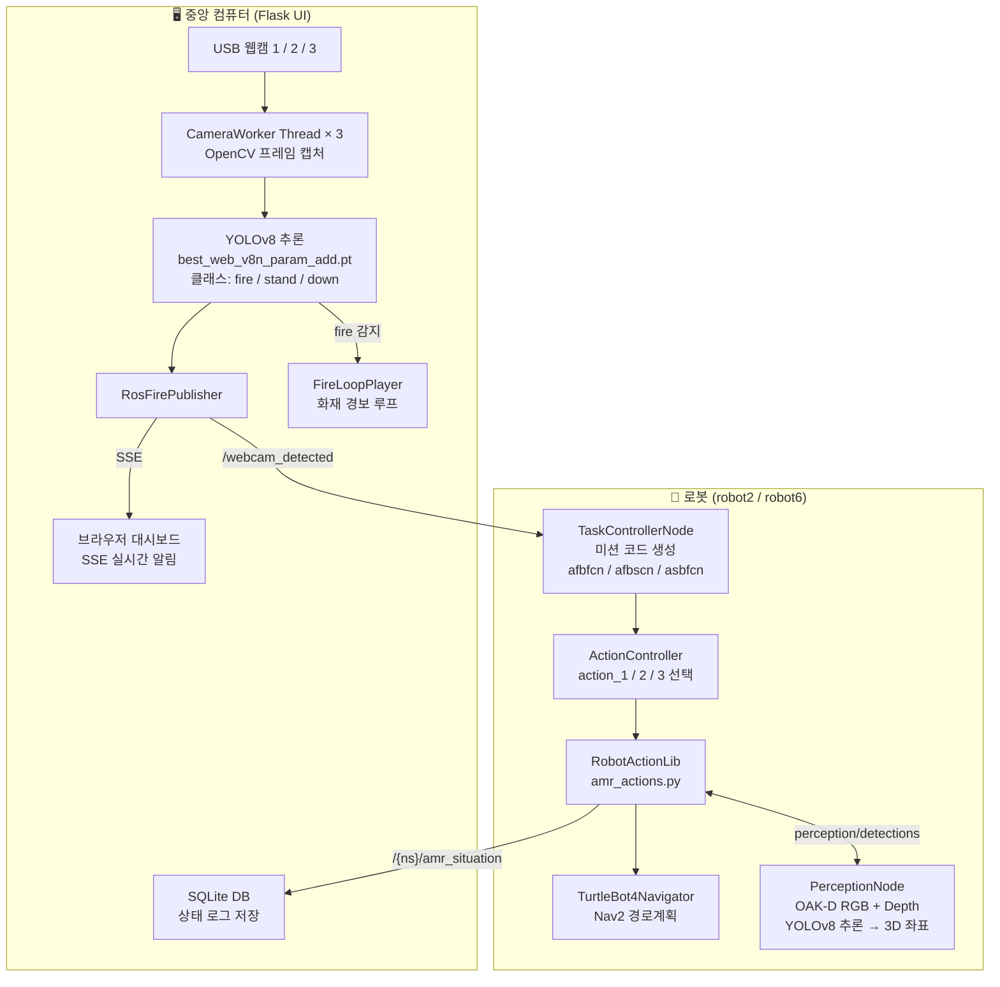
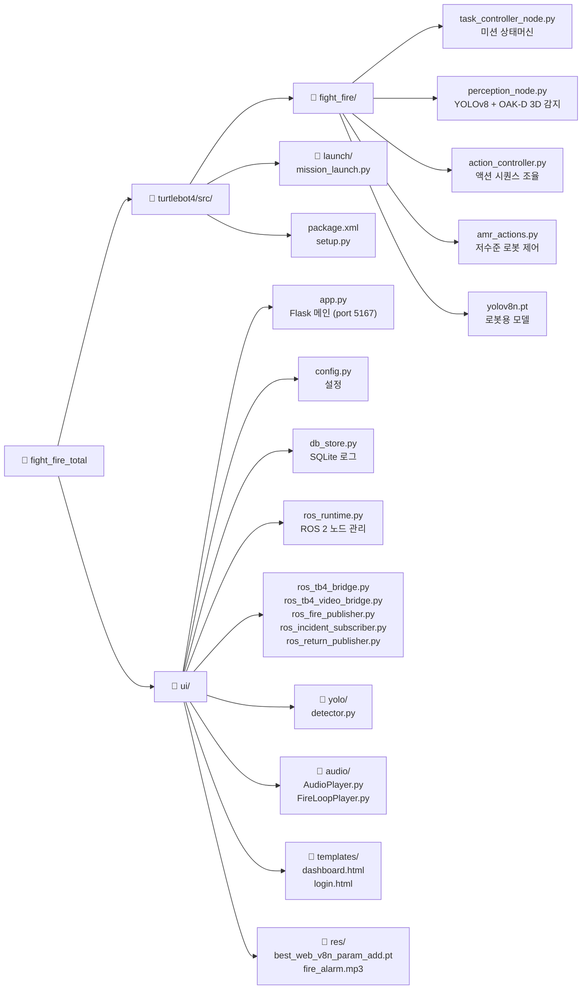
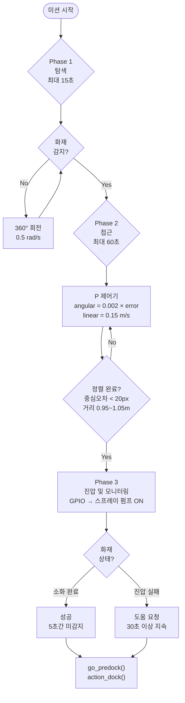
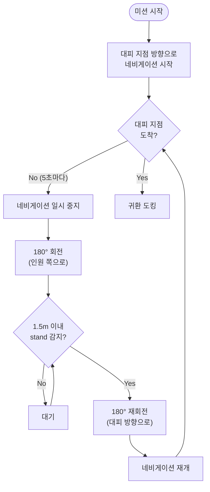
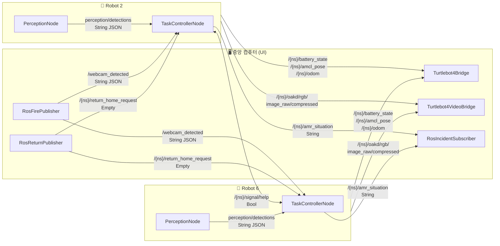

# Fight Fire Total

**자율 이동 로봇(AMR) 기반 화재 진압 및 인명 대피 유도 시스템**

YOLOv8 객체 탐지, ROS 2 기반 TurtleBot4 이중 로봇 제어, 실시간 웹 모니터링 대시보드를 통합한 자율 화재 대응 시스템입니다.

---

## 데모 영상

[](https://www.youtube.com/watch?v=4pthE7uKva8)

---

## 목차

- [시스템 개요](#시스템-개요)
- [아키텍처](#아키텍처)
- [프로젝트 구조](#프로젝트-구조)
- [동작 시나리오](#동작-시나리오)
- [주요 컴포넌트](#주요-컴포넌트)
  - [TurtleBot4 ROS 2 패키지](#turtlebot4-ros-2-패키지)
  - [웹 UI (Flask)](#웹-ui-flask)
- [알고리즘 및 ML 상세](#알고리즘-및-ml-상세)
- [ROS 2 토픽 맵](#ros-2-토픽-맵)
- [설치 및 실행](#설치-및-실행)
- [하드웨어 구성](#하드웨어-구성)
- [기술 스택](#기술-스택)

---

## 시스템 개요



두 대의 TurtleBot4 로봇이 각각의 공간을 담당하여:
- **화재 감지 공간** → 로봇이 이동 후 스프레이 펌프로 화재 진압
- **인원 감지 공간** → 로봇이 이동 후 인원을 대피 지점까지 유도

---

## 아키텍처

### 전체 데이터 흐름



---

## 프로젝트 구조



---

## 동작 시나리오

웹캠이 세 구역(class_a, class_b, class_c)을 각각 감시하며, 감지 결과를 조합한 **미션 코드**를 생성합니다.

### 미션 코드 생성 규칙

```python
# 각 구역별 코드: f(fire), s(stand), d(down), n(none)
code = f"a{a}b{b}c{c}"
```

| 미션 코드 | 상황 | Robot 2 역할 | Robot 6 역할 |
|-----------|------|-------------|-------------|
| `afbfcn`  | A구역 화재, B구역 화재 | 방 A 화재 진압 | 방 B 화재 진압 |
| `afbscn`  | A구역 화재, B구역 인원 | 방 A 화재 진압 | 방 B 인원 대피 유도 |
| `asbfcn`  | A구역 인원, B구역 화재 | 방 A 인원 대피 유도 | 방 B 화재 진압 |

### 화재 진압 시퀀스 (fire_suppression_mission)



### 인원 대피 유도 시퀀스 (guide_human_seq)



---

## 주요 컴포넌트

### TurtleBot4 ROS 2 패키지

#### `task_controller_node.py` — 미션 상태머신

각 로봇에서 실행되는 핵심 노드. 웹캠 감지 결과를 수신하여 미션 코드로 변환하고 적절한 액션을 실행합니다.

- **구독 토픽:** `/webcam_detected`, `perception/detections`, `/{other_ns}/signal/help`
- **발행 토픽:** `/{ns}/amr_situation` (미션 상태 보고)
- **주요 기능:**
  - 미션 코드 디바운싱 (2.0초)
  - 페어 로봇과의 도움 요청 신호 처리
  - 별도 스레드에서 미션 루프 실행 (ROS 콜백과 분리)

#### `perception_node.py` — 3D 객체 감지

OAK-D 카메라의 RGB + Depth 스트림을 융합하여 화재 및 인원의 3D 위치를 추정합니다.

- **구독 토픽:** `/{ns}/oakd/rgb/image_raw/compressed`, `/{ns}/oakd/stereo/image_raw`, `/{ns}/oakd/rgb/camera_info`
- **발행 토픽:** `perception/detections` (JSON), `/{ns}/yolo_debug/compressed` (디버그 영상)
- **처리 과정:**
  ```
  RGB 프레임 디컴프레스
  → YOLOv8 추론 (~10 FPS 스로틀링)
  → 바운딩박스 중심점의 깊이값 샘플링 (ROI 중심 ±10%)
  → 미디안 필터로 깊이 노이즈 제거
  → 카메라 내부 파라미터로 픽셀(u,v,z) → 3D 좌표 변환
  → JSON 발행: [class, confidence, distance, center_2d, bbox]
  ```

#### `action_controller.py` — 액션 시퀀스 조율

세 가지 고수준 액션(`action_1/2/3`)을 정의하고, 각 로봇의 네임스페이스에 맞게 실행합니다.

- `action_1`: 양쪽 모두 화재 → 현재 로봇의 담당 방 화재 진압
- `action_2`: A화재 + B인원 → robot2는 A진압, robot6은 B유도
- `action_3`: A인원 + B화재 → robot2는 A유도, robot6은 B진압
- 오류 복구: 도킹 실패 시 폴백 재시도

#### `amr_actions.py` — 저수준 로봇 제어

TurtleBot4Navigator를 래핑한 로봇 액션 라이브러리.

| 메서드 | 기능 |
|--------|------|
| `go_to_A()` / `go_to_B()` | Nav2 기반 고정 웨이포인트 이동 |
| `go_predock()` | 도킹 전 사전 위치 이동 |
| `action_dock()` / `action_undock()` | 도킹/언도킹 |
| `fire_suppression_mission()` | 3단계 화재 진압 (탐색→접근→진압) |
| `guide_human_seq()` | 인원 대피 유도 시퀀스 |
| `beep()` | 상태 알림 비프음 (성공/오류/시작) |

**GPIO 스프레이 펌프 제어:**
```python
# 외부 GPIO 장치 (192.168.108.200:4000) HTTP 요청으로 펌프 ON/OFF
requests.get("http://192.168.108.200:4000/on")
requests.get("http://192.168.108.200:4000/off")
```

---

### 웹 UI (Flask)

중앙 컴퓨터에서 실행되는 모니터링 및 제어 서버 (포트 **5167**).

#### `app.py` — Flask 메인 서버

**API 엔드포인트:**

| 경로 | 메서드 | 기능 |
|------|--------|------|
| `/login` | GET/POST | 인증 로그인 |
| `/dashboard` | GET | 메인 대시보드 |
| `/video_feed1` ~ `/video_feed3` | GET | 웹캠 MJPEG 스트림 |
| `/tb4_video_feed` | GET | 로봇 카메라 MJPEG 스트림 |
| `/events` | GET | SSE 실시간 감지 이벤트 |
| `/tb4_events` | GET | SSE 로봇 상태 이벤트 |
| `/api/tb4_status` | GET | 로봇 배터리/위치/속도 |
| `/api/incident_status` | GET | 로봇 미션 진행 상태 |
| `/api/return_home` | POST | 로봇 귀환 명령 |
| `/api/db/robot_status` | GET | DB 저장 히스토리 조회 |
| `/api/cameras/start` | POST | 웹캠 감지 시작 |
| `/api/cameras/stop` | POST | 웹캠 감지 중지 |
| `/api/alarm/stop` | POST | 화재 경보 수동 중지 |

#### `yolo/detector.py` — 웹캠 YOLO 감지 워커

3개의 USB 웹캠을 각각 별도 스레드에서 처리하는 `CameraWorker` 클래스.

```python
# 감지 이벤트 구조
{
  "camera": "cam1",
  "label": "fire",        # fire / stand / down
  "confidence": 0.92,
  "bbox": [x1, y1, x2, y2]
}
```

- 클래스별 **1.0초 디바운싱** 적용
- 감지 시 `on_detect` 콜백 호출 → `RosFirePublisher`로 전달
- MJPEG 스트리밍용 최신 프레임 저장

#### `ros_runtime.py` — ROS 2 노드 생명주기 관리

Flask 앱 시작 시 백그라운드 데몬 스레드에서 ROS 2 환경을 초기화하고 모든 브리지 노드를 관리합니다.

```
RosRuntime.start()
  ├─ rclpy.init()
  ├─ MultiThreadedExecutor 생성
  ├─ Turtlebot4Bridge × 2 (robot2, robot6)
  ├─ Turtlebot4VideoBridge × 2
  ├─ RosFirePublisher
  ├─ RosReturnPublisher
  └─ RosIncidentSubscriber × 2
```

#### `db_store.py` — SQLite 상태 로그

`robot_status_log` 테이블에 2초 간격으로 로봇 상태를 저장합니다.

| 컬럼 | 타입 | 설명 |
|------|------|------|
| timestamp | TEXT | ISO 8601 시각 |
| robot_ns | TEXT | /robot2 또는 /robot6 |
| connected | INTEGER | 연결 상태 |
| battery_pct | REAL | 배터리 잔량 (%) |
| pose_x, pose_y, pose_yaw | REAL | 로봇 위치/방향 |
| vel_linear, vel_angular | REAL | 선속도/각속도 |
| incident_status | TEXT | 미션 상태 JSON |

#### `audio/FireLoopPlayer.py` — 화재 경보 루프 플레이어

화재 감지 시 경보음을 루프 재생하고, 마지막 감지 후 홀드 시간이 경과하면 자동 중지합니다.

```python
fire_loop.notify_fire()    # 화재 감지 시 호출 (루프 연장)
fire_loop.stop_alarm()     # 수동 중지 (침묵 기간 적용)
```

---

## 알고리즘 및 ML 상세

### YOLOv8 모델

| 항목 | 로봇용 (`yolov8n.pt`) | 웹캠용 (`best_web_v8n_param_add.pt`) |
|------|----------------------|--------------------------------------|
| 아키텍처 | YOLOv8 Nano | YOLOv8 Nano (커스텀 파인튜닝) |
| 감지 클래스 | fire, stand, down | fire, stand, down |
| 신뢰도 임계값 | 0.7 | 0.7 (config.py) |
| 입력 크기 | 640×640 | 640×640 |
| 추론 위치 | 로봇 내장 컴퓨터 | 중앙 모니터링 컴퓨터 |

### 화재 접근 제어 (Phase 2)

```python
# 비례 제어기 (P Controller)
center_error = cx - img_center_x         # 픽셀 오차
angular_vel = 0.002 * center_error        # 각속도 (rad/s)
angular_vel = clamp(angular_vel, -0.4, 0.4)

# 거리 기반 선속도
if distance > 1.05:
    linear_vel = 0.15    # 전진
elif distance < 0.95:
    linear_vel = -0.05   # 후진
else:
    linear_vel = 0.0     # 정지

# 종료 조건
done = (abs(center_error) < 20) and (0.95 < distance < 1.05)
```

### 깊이 추정 (PerceptionNode)

```python
# 바운딩박스 중심 ROI에서 깊이값 샘플링
roi = depth_image[
    cy - box_h//10 : cy + box_h//10,
    cx - box_w//10 : cx + box_w//10
]
distance = np.median(roi[roi > 0])  # 유효 깊이값의 중앙값

# 카메라 내부 파라미터로 3D 변환
X = (cx - camera_cx) * distance / camera_fx
Y = (cy - camera_cy) * distance / camera_fy
Z = distance
```

---

## ROS 2 토픽 맵



---

## 설치 및 실행

### 환경 요구사항

- **OS:** Ubuntu 22.04
- **ROS 2:** Humble 또는 Iron
- **Python:** 3.10+
- **로봇:** TurtleBot4 Standard (OAK-D 카메라 내장)
- **GPU (선택):** CUDA 지원 GPU (추론 가속)

### 의존성 설치

```bash
# ROS 2 TurtleBot4 패키지
sudo apt install ros-humble-turtlebot4-*

# Python 의존성 (UI 서버)
pip install flask ultralytics opencv-python rclpy mutagen requests

# 오디오 백엔드 (둘 중 하나)
sudo apt install ffmpeg     # ffplay 포함
sudo apt install mpg123
```

### 1. ROS 2 패키지 빌드 (로봇에서 실행)

```bash
cd fight_fire_total/turtlebot4
colcon build
source install/setup.bash
```

### 2. 로봇 노드 실행

```bash
# robot2 실행
ros2 launch fight_fire mission_launch.py --ros-args -r __ns:=/robot2

# robot6 실행 (별도 터미널 또는 별도 로봇)
ros2 launch fight_fire mission_launch.py --ros-args -r __ns:=/robot6
```

### 3. 웹 UI 서버 실행 (중앙 컴퓨터)

```bash
cd fight_fire_total/ui
python app.py
```

브라우저에서 `http://localhost:5167` 접속 후 로그인합니다.

### 4. 설정 수정 (`ui/config.py`)

```python
# 웹캠 장치 경로 (by-path 사용 권장)
CAM1 = "/dev/v4l/by-path/..."
CAM2 = "/dev/v4l/by-path/..."
CAM3 = "/dev/v4l/by-path/..."

# YOLO 모델 설정
YOLO_MODEL_PATH = "res/best_web_v8n_param_add.pt"
YOLO_CONF = 0.7
YOLO_IMGSZ = 640

# ROS 사용 여부
ROS_ENABLED = True
```

---

## 하드웨어 구성

| 장치 | 수량 | 역할 |
|------|------|------|
| TurtleBot4 Standard | 2 | 자율 이동 로봇 (robot2, robot6) |
| OAK-D Camera | 2 (로봇 내장) | RGB+Depth 스트림 → YOLOv8 추론 |
| USB 웹캠 | 3 | 복도/방 감시 |
| 스프레이 펌프 + GPIO 컨트롤러 | 1 | 화재 진압 (HTTP: 192.168.108.200:4000) |
| 중앙 모니터링 PC | 1 | Flask UI 서버, 웹캠 추론 |

---

## 기술 스택

**Robot & Middleware**<br/>


**Computer Vision & AI**<br/>


**Web & Backend**<br/>


**Language & Runtime**<br/>


**Audio**<br/>


